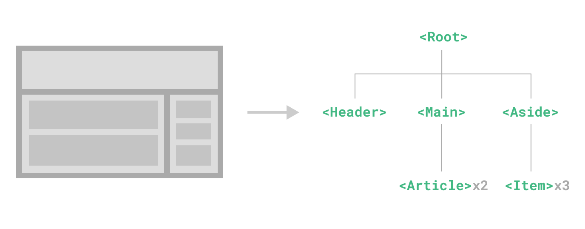

# Kiến thức cơ bản về Components {#components-basics}

<ScrimbaLink href="https://scrimba.com/links/vue-component-basics" title="Free Vue.js Components Basics Lesson" type="scrimba">
  Xem video bài học tương tác trên Scrimba
</ScrimbaLink>

Component cho phép chúng ta chia UI thành các phần độc lập và có thể tái sử dụng, và suy nghĩ về từng phần một cách riêng biệt. Thông thường, một ứng dụng sẽ được tổ chức thành một cây các component lồng nhau:

 

Điều này rất giống với cách chúng ta lồng các phần tử HTML gốc, nhưng Vue triển khai một mô hình component riêng cho phép chúng ta đóng gói (encapsulate) nội dung và logic tùy chỉnh trong mỗi component. Vue cũng tương thích tốt với Web Components gốc. Nếu bạn tò mò về mối quan hệ giữa Vue Components và Web Components gốc, [xem thêm tại đây](/guide/extras/web-components).

## Định nghĩa một Component {#defining-a-component}

Khi sử dụng build step, chúng ta thường định nghĩa mỗi Vue component trong một file riêng với extension `.vue` - được gọi là [Single-File Component](/guide/scaling-up/sfc) (SFC):

<div class="options-api">

```vue
<script>
export default {
  data() {
    return {
      count: 0
    }
  }
}
</script>

<template>
  <button @click="count++">Bạn đã click tôi {{ count }} lần.</button>
</template>
```

</div>
<div class="composition-api">

```vue
<script setup>
import { ref } from 'vue'

const count = ref(0)
</script>

<template>
  <button @click="count++">Bạn đã click tôi {{ count }} lần.</button>
</template>
```

</div>

Khi không sử dụng build step, một Vue component có thể được định nghĩa như một object JavaScript thông thường chứa các tùy chọn riêng của Vue:

<div class="options-api">

```js
export default {
  data() {
    return {
      count: 0
    }
  },
  template: `
    <button @click="count++">
      Bạn đã click tôi {{ count }} lần.
    </button>`
}
```

</div>
<div class="composition-api">

```js
import { ref } from 'vue'

export default {
  setup() {
    const count = ref(0)
    return { count }
  },
  template: `
    <button @click="count++">
      Bạn đã click tôi {{ count }} lần.
    </button>`
  // Cũng có thể trỏ tới một template trong DOM:
  // template: '#my-template-element'
}
```

</div>

Ở đây template được viết inline dưới dạng chuỗi JavaScript, Vue sẽ compile (biên dịch) nó khi chạy. Bạn cũng có thể dùng selector theo ID trỏ tới một phần tử (thường là `<template>` gốc) - Vue sẽ dùng nội dung của nó làm template.

Ví dụ trên định nghĩa một component đơn và export nó như default export của file `.js`, nhưng bạn cũng có thể dùng named export để export nhiều component trong cùng một file.

## Sử dụng Component {#using-a-component}

:::tip
Chúng tôi sẽ dùng cú pháp SFC cho phần còn lại của hướng dẫn này - các khái niệm về component là như nhau dù bạn có dùng build step hay không. Phần [Examples](/examples/) hiển thị cách dùng component trong cả hai trường hợp.
:::

Để sử dụng component con, chúng ta cần import nó vào component cha. Giả sử component counter nằm trong file `ButtonCounter.vue`, component đó sẽ được export mặc định:

<div class="options-api">

```vue
<script>
import ButtonCounter from './ButtonCounter.vue'

export default {
  components: {
    ButtonCounter
  }
}
</script>

<template>
  <h1>Đây là một component con!</h1>
  <ButtonCounter />
</template>
```

Để sử dụng component trong template, chúng ta cần [đăng ký](/guide/components/registration) nó với option `components`. Component sẽ có thể dùng như một thẻ HTML với tên đã đăng ký.

</div>

<div class="composition-api">

```vue
<script setup>
import ButtonCounter from './ButtonCounter.vue'
</script>

<template>
  <h1>Đây là một component con!</h1>
  <ButtonCounter />
</template>
```

Với `<script setup>`, các component import sẽ tự động dùng được trong template.

</div>

Bạn cũng có thể đăng ký component ở phạm vi global, giúp nó dùng được ở mọi component mà không cần import. Ưu nhược điểm của global và local registration được nói trong phần [Component Registration](/guide/components/registration).

Component có thể được tái sử dụng nhiều lần:

```vue-html
<h1>Đây là nhiều component con!</h1>
<ButtonCounter />
<ButtonCounter />
<ButtonCounter />
```

Lưu ý rằng khi click vào các button, mỗi cái giữ state `count` riêng. Đó là vì mỗi lần dùng component, một **instance (thể hiện)** mới được tạo ra.

Trong SFC, nên dùng tên tag `PascalCase` cho component con để phân biệt với HTML gốc. Mặc dù HTML không phân biệt chữ hoa thường, nhưng SFC được compile nên có thể dùng tên phân biệt chữ hoa thường. Bạn cũng có thể dùng `/>` để đóng tag.

Nếu bạn viết template trực tiếp trong DOM (ví dụ trong `<template>` gốc), thì template sẽ tuân theo cách parse HTML của trình duyệt. Khi đó, bạn cần dùng `kebab-case` và đóng tag đầy đủ:

```vue-html
<!-- nếu template nằm trong DOM -->
<button-counter></button-counter>
<button-counter></button-counter>
<button-counter></button-counter>
```

Xem thêm [in-DOM template parsing caveats](#in-dom-template-parsing-caveats).

## Truyền Props {#passing-props}

Nếu xây dựng blog, bạn sẽ cần component đại diện cho một bài viết. Tất cả bài viết dùng cùng layout nhưng nội dung khác nhau. Component sẽ không hữu ích nếu không truyền dữ liệu vào, ví dụ tiêu đề và nội dung. Đó là vai trò của props.

Props là các attribute tùy chỉnh mà bạn đăng ký cho component. Để truyền tiêu đề, cần khai báo nó trong danh sách props của component, dùng <span class="options-api">[`props`](/api/options-state#props)</span><span class="composition-api">[`defineProps`](/api/sfc-script-setup#defineprops-defineemits)</span>:

<div class="options-api">

```vue [BlogPost.vue]
<script>
export default {
  props: ['title']
}
</script>

<template>
  <h4>{{ title }}</h4>
</template>
```

</div>
<div class="composition-api">

```vue [BlogPost.vue]
<script setup>
defineProps(['title'])
</script>

<template>
  <h4>{{ title }}</h4>
</template>
```

`defineProps` là macro compile-time chỉ dùng trong `<script setup>` và không cần import. Props sẽ tự động dùng được trong template. Nó cũng trả về object chứa props:

```js
const props = defineProps(['title'])
console.log(props.title)
```

Xem thêm: [Typing Component Props](/guide/typescript/composition-api#typing-component-props)

Nếu không dùng `<script setup>`, props khai báo bằng `props` và được truyền vào `setup()`:

```js
export default {
  props: ['title'],
  setup(props) {
    console.log(props.title)
  }
}
```

</div>

Component có thể có nhiều props và mặc định có thể truyền bất kỳ giá trị nào.

Sau khi đăng ký, bạn truyền dữ liệu như attribute:

```vue-html
<BlogPost title="Hành trình của tôi với Vue" />
<BlogPost title="Viết blog với Vue" />
<BlogPost title="Vì sao Vue thú vị" />
```

Trong app thực tế, thường có mảng dữ liệu:

<div class="options-api">

```js
export default {
  data() {
    return {
      posts: [
        { id: 1, title: 'Hành trình của tôi với Vue' },
        { id: 2, title: 'Viết blog với Vue' },
        { id: 3, title: 'Vì sao Vue thú vị' }
      ]
    }
  }
}
```

</div>
<div class="composition-api">

```js
const posts = ref([
  { id: 1, title: 'Hành trình của tôi với Vue' },
  { id: 2, title: 'Viết blog với Vue' },
  { id: 3, title: 'Vì sao Vue thú vị' }
])
```

</div>

Sau đó render bằng `v-for`:

```vue-html
<BlogPost
  v-for="post in posts"
  :key="post.id"
  :title="post.title"
/>
```

Lưu ý dùng [`v-bind`](/api/built-in-directives#v-bind) (`:title="post.title"`) để truyền giá trị động. Điều này hữu ích khi không biết trước nội dung.

Đó là tất cả những gì bạn cần biết về props hiện tại, nhưng sau khi đọc xong trang này và cảm thấy thoải mái với nội dung, chúng tôi khuyến nghị bạn quay lại đọc đầy đủ hướng dẫn về [Props](/guide/components/props).

## Lắng nghe Events {#listening-to-events}

Khi phát triển `<BlogPost>`, có thể cần giao tiếp ngược lên component cha. Ví dụ, thêm tính năng tăng cỡ chữ.

Ở component cha, thêm `postFontSize`:

<div class="options-api">

```js
data() {
  return {
    posts: [
      /* ... */
    ],
    postFontSize: 1
  }
}
```

</div>
<div class="composition-api">

```js
const posts = ref([
  /* ... */
])

const postFontSize = ref(1)
```

</div>

Dùng trong template:

```vue-html
<div :style="{ fontSize: postFontSize + 'em' }">
  <BlogPost
    v-for="post in posts"
    :key="post.id"
    :title="post.title"
  />
</div>
```

Thêm button trong `<BlogPost>`:

```vue
<template>
  <div class="blog-post">
    <h4>{{ title }}</h4>
    <button>Tăng chữ</button>
  </div>
</template>
```

Để button gửi thông tin lên cha, dùng event:

```vue-html
<BlogPost
  ...
  @enlarge-text="postFontSize += 0.1"
/>
```

Component con emit event bằng `$emit`:

```vue
<template>
  <div class="blog-post">
    <h4>{{ title }}</h4>
    <button @click="$emit('enlarge-text')">Tăng chữ</button>
  </div>
</template>
```

Cha sẽ nhận event và cập nhật `postFontSize`.

Có thể khai báo event bằng <span class="options-api">[`emits`](/api/options-state#emits) option</span><span class="composition-api">[`defineEmits`](/api/sfc-script-setup#defineprops-defineemits) macro</span>:

<div class="options-api">

```vue [BlogPost.vue]
<script>
export default {
  props: ['title'],
  emits: ['enlarge-text']
}
</script>
```

</div>
<div class="composition-api">

```vue [BlogPost.vue]
<script setup>
defineProps(['title'])
defineEmits(['enlarge-text'])
</script>
```

</div>

Điều này giúp document tất cả event mà component emit ra và tùy chọn [validate chúng](/guide/components/events#events-validation). Nó cũng cho phép Vue tránh áp dụng ngầm định chúng như native listener lên root element của component con.

<div class="composition-api">

Tương tự `defineProps`, `defineEmits` chỉ dùng được trong `<script setup>` và không cần import. Nó trả về hàm `emit` tương đương với phương thức `$emit`. Có thể dùng để emit event trong phần `<script setup>` của component, nơi `$emit` không trực tiếp truy cập được:

```vue
<script setup>
const emit = defineEmits(['enlarge-text'])

emit('enlarge-text')
</script>
```

Nếu không dùng `<script setup>`, bạn có thể khai báo event bằng option `emits`. Bạn có thể truy cập hàm `emit` như property của setup context (được truyền vào `setup()` như đối số thứ hai):

```js
export default {
  emits: ['enlarge-text'],
  setup(props, ctx) {
    ctx.emit('enlarge-text')
  }
}
```

</div>

Đó là tất cả những gì bạn cần biết về custom component event hiện tại, nhưng sau khi đọc xong trang này và cảm thấy thoải mái với nội dung, chúng tôi khuyến nghị bạn quay lại đọc đầy đủ hướng dẫn về [Custom Events](/guide/components/events).

## Truyền nội dung với Slots {#content-distribution-with-slots}

Tương tự HTML, có khi cần truyền nội dung vào component, như thế này:

```vue-html
<AlertBox>
  Có lỗi xảy ra.
</AlertBox>
```

Có thể thực hiện bằng element `<slot>` tùy chỉnh của Vue:

```vue [AlertBox.vue]
<template>
  <div class="alert-box">
    <strong>Đây là lỗi demo</strong>
    <slot />
  </div>
</template>
```

Như bạn thấy ở trên, chúng ta dùng `<slot>` như placeholder cho nội dung sẽ được chèn vào — và vậy là xong!

Đó là tất cả những gì bạn cần biết về slot hiện tại, nhưng sau khi đọc xong trang này và cảm thấy thoải mái với nội dung, chúng tôi khuyến nghị bạn quay lại đọc đầy đủ hướng dẫn về [Slots](/guide/components/slots).

## Dynamic Components {#dynamic-components}

Có khi cần chuyển đổi linh hoạt giữa các component, ví dụ trong giao diện tab.

Điều trên được thực hiện bởi element `<component>` của Vue với attribute đặc biệt `is`:

<div class="options-api">

```vue-html
<!-- Component thay đổi khi currentTab thay đổi -->
<component :is="currentTab"></component>
```

</div>
<div class="composition-api">

```vue-html
<!-- Component thay đổi khi currentTab thay đổi -->
<component :is="tabs[currentTab]"></component>
```

</div>

Trong ví dụ trên, giá trị được truyền vào `:is` có thể chứa:

- chuỗi tên của một component đã đăng ký, HOẶC
- object component thực sự được import

Bạn cũng có thể dùng attribute `is` để tạo các HTML element thông thường.

Khi chuyển đổi giữa nhiều component với `<component :is="...">`, component cũ sẽ bị unmount. Có thể buộc các component không hoạt động ở lại "sống" bằng [component `<KeepAlive>` built-in](/guide/built-ins/keep-alive).

## Lưu ý khi parse template trong DOM {#in-dom-template-parsing-caveats}

Nếu viết template Vue trực tiếp trong DOM, Vue phải lấy chuỗi template từ DOM. Điều này dẫn đến một số lưu ý do cách parse HTML gốc của trình duyệt.

:::tip
Cần lưu ý rằng các hạn chế được thảo luận dưới đây chỉ áp dụng nếu bạn viết template trực tiếp trong DOM. Chúng **KHÔNG** áp dụng nếu bạn dùng string template từ các nguồn sau:

- Single-File Components
- Chuỗi template inline (ví dụ: `template: '...'`)
- `<script type="text/x-template">`
  :::

### Không phân biệt chữ hoa thường {#case-insensitivity}

HTML tag và tên attribute không phân biệt chữ hoa thường, nên trình duyệt sẽ hiểu bất kỳ ký tự hoa nào là chữ thường. Điều đó có nghĩa là khi dùng in-DOM template, tên component viết PascalCase và tên prop viết camelCase hoặc tên event `v-on` đều cần dùng dạng kebab-case (ngăn cách bằng dấu gạch ngang):

```js
// camelCase trong JavaScript
const BlogPost = {
  props: ['postTitle'],
  emits: ['updatePost'],
  template: `
    <h3>{{ postTitle }}</h3>
  `
}
```

```vue-html
<!-- kebab-case trong HTML -->
<blog-post post-title="hello!" @update-post="onUpdatePost"></blog-post>
```

### Self Closing Tags {#self-closing-tags}

Chúng ta đã dùng self-closing tag cho component trong các ví dụ trước:

```vue-html
<MyComponent />
```

Vì template parser của Vue hiểu `/>` là dấu hiệu kết thúc bất kỳ tag nào, bất kể loại của nó.

Tuy nhiên trong in-DOM template, phải luôn dùng closing tag đầy đủ:

```vue-html
<my-component></my-component>
```

Vì đặc tả HTML chỉ cho phép [một số phần tử cụ thể](https://html.spec.whatwg.org/multipage/syntax.html#void-elements) bỏ qua closing tag, phổ biến nhất là `<input>` và ``. Với tất cả các phần tử khác, nếu bỏ closing tag, HTML parser gốc sẽ cho rằng bạn chưa kết thúc thẻ mở. Ví dụ, đoạn code sau:

```vue-html
<my-component /> <!-- chúng ta muốn đóng tag ở đây... -->
<span>hello</span>
```

sẽ được parse thành:

```vue-html
<my-component>
  <span>hello</span>
</my-component> <!-- nhưng trình duyệt sẽ đóng nó ở đây. -->
```

### Giới hạn vị trí phần tử {#element-placement-restrictions}

Một số phần tử HTML có hạn chế con. Ví dụ:

```vue-html
<table>
  <blog-post-row></blog-post-row>
</table>
```

Sẽ lỗi. Cách đúng:

```vue-html
<table>
  <tr is="vue:blog-post-row"></tr>
</table>
```

:::tip
Khi dùng trên HTML element gốc, giá trị của `is` phải có tiền tố `vue:` để được hiểu là Vue component. Điều này cần thiết để tránh nhầm lẫn với [customized built-in elements](https://html.spec.whatwg.org/multipage/custom-elements.html#custom-elements-customized-builtin-example) gốc.
:::

Đó là tất cả những gì bạn cần biết về in-DOM template parsing caveats hiện tại - và thực ra, đây cũng là phần kết của Vue _Essentials_. Chúc mừng! Vẫn còn nhiều thứ để học, nhưng trước tiên, chúng tôi khuyến nghị bạn nghỉ một chút và tự mình thực hành Vue - hãy xây dựng thứ gì đó thú vị, hoặc xem qua một số [Examples](/examples/) nếu bạn chưa làm vậy.

Khi bạn đã cảm thấy thoải mái với kiến thức vừa tiếp thu, hãy tiếp tục với phần hướng dẫn để tìm hiểu sâu hơn về component.
