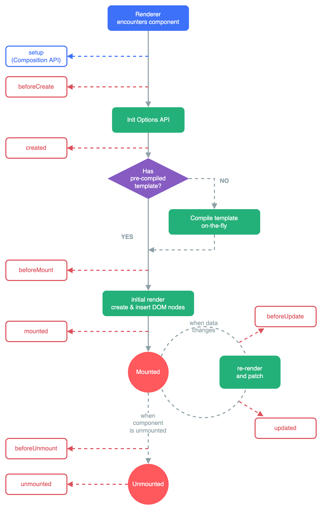

# Lifecycle Hooks {#lifecycle-hooks}

Mỗi instance của component Vue sẽ trải qua một chuỗi các bước khởi tạo khi nó được tạo ra - ví dụ, nó cần thiết lập quan sát dữ liệu (data observation), compile template, mount instance vào DOM, và cập nhật DOM khi dữ liệu thay đổi. Trong quá trình đó, nó cũng chạy các hàm được gọi là lifecycle hooks (các hook vòng đời), cho phép người dùng chèn code của mình vào các giai đoạn cụ thể.

## Đăng ký Lifecycle Hooks {#registering-lifecycle-hooks}

Ví dụ, hook <span class="composition-api">`onMounted`</span><span class="options-api">`mounted`</span> có thể được dùng để chạy code sau khi component hoàn tất render lần đầu và tạo các DOM node:

<div class="composition-api">

```vue
<script setup>
import { onMounted } from 'vue'

onMounted(() => {
  console.log(`component đã được mount.`)
})
</script>
```

</div>
<div class="options-api">

```js
export default {
  mounted() {
    console.log(`component đã được mount.`)
  }
}
```

</div>

Ngoài ra còn có các hook khác sẽ được gọi ở các giai đoạn khác nhau trong vòng đời của instance, trong đó phổ biến nhất là <span class="composition-api">[`onMounted`](/api/composition-api-lifecycle#onmounted), [`onUpdated`](/api/composition-api-lifecycle#onupdated), và [`onUnmounted`](/api/composition-api-lifecycle#onunmounted).</span><span class="options-api">[`mounted`](/api/options-lifecycle#mounted), [`updated`](/api/options-lifecycle#updated), và [`unmounted`](/api/options-lifecycle#unmounted).</span>

<div class="options-api">

Tất cả lifecycle hook đều được gọi với context `this` trỏ tới instance hiện tại đang gọi nó. Điều này có nghĩa là bạn nên tránh dùng arrow function khi khai báo lifecycle hook, vì khi đó bạn sẽ không thể truy cập instance của component thông qua `this`.

</div>

<div class="composition-api">

Khi gọi `onMounted`, Vue sẽ tự động gắn callback đã đăng ký với instance component hiện tại đang active. Điều này yêu cầu các hook phải được đăng ký **một cách đồng bộ (synchronous)** trong quá trình setup của component. Ví dụ, không nên làm như sau:

```js
setTimeout(() => {
  onMounted(() => {
    // đoạn này sẽ không hoạt động.
  })
}, 100)
```

Lưu ý rằng điều này không có nghĩa là lời gọi phải nằm trực tiếp bên trong `setup()` hoặc `<script setup>`. `onMounted()` có thể được gọi trong một hàm bên ngoài, miễn là call stack là synchronous và bắt nguồn từ bên trong `setup()`.

</div>

## Sơ đồ vòng đời {#lifecycle-diagram}

Bên dưới là sơ đồ vòng đời của instance. Bạn không cần hiểu hết mọi thứ ngay bây giờ, nhưng khi học sâu hơn và xây dựng nhiều hơn, đây sẽ là một tài liệu tham khảo hữu ích.

 

<!-- https://www.figma.com/file/Xw3UeNMOralY6NV7gSjWdS/Vue-Lifecycle -->

Tham khảo <span class="composition-api">[Lifecycle Hooks API reference](/api/composition-api-lifecycle)</span><span class="options-api">[Lifecycle Hooks API reference](/api/options-lifecycle)</span> để biết chi tiết về tất cả lifecycle hook và các trường hợp sử dụng tương ứng.
